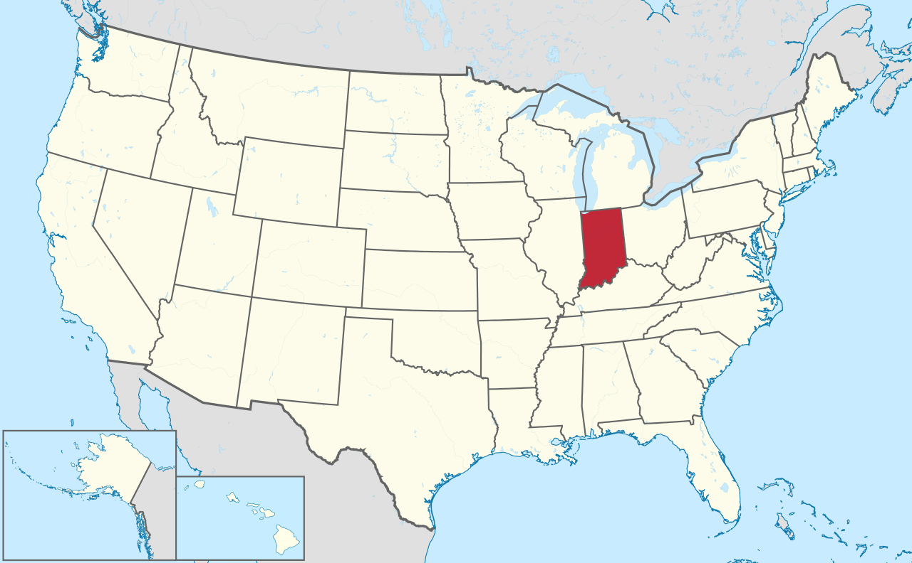
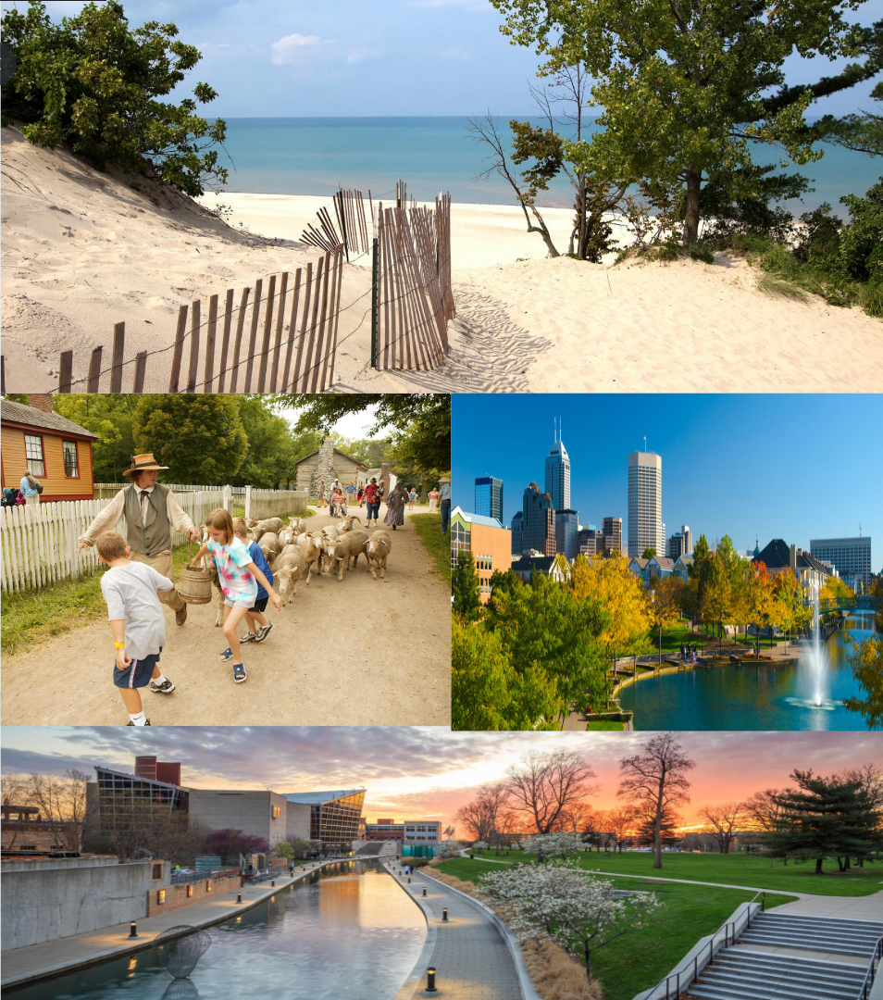
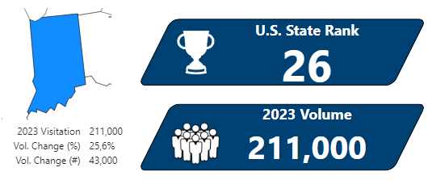
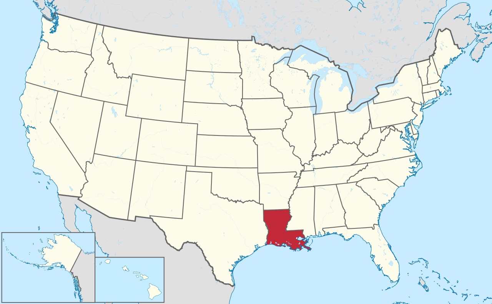
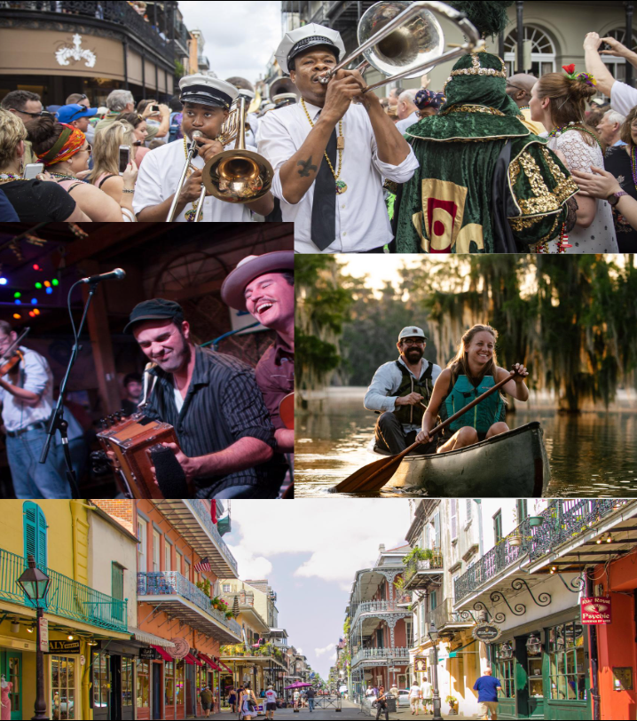
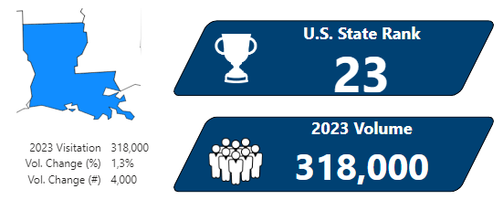
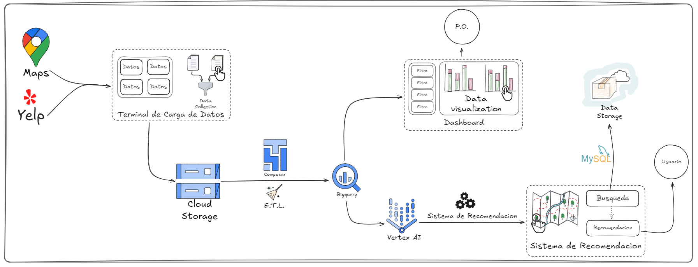
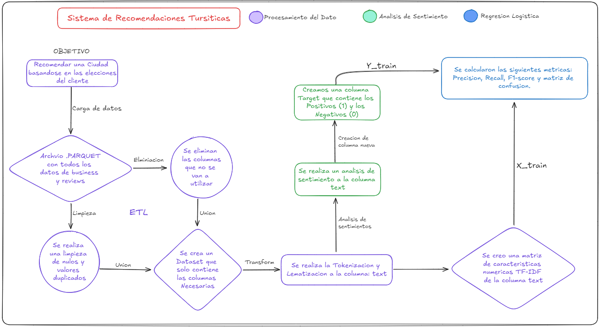
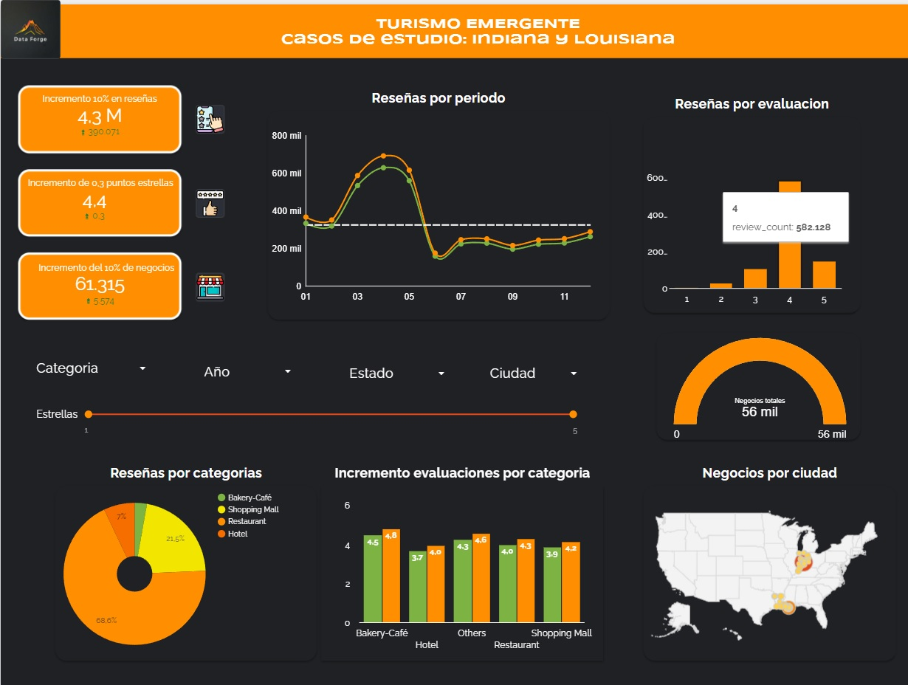

 Proyecto Final SoyHenry 

   

   <em>Data Forge - Forging the Future</em>

## Quiénes somos: Data Forge
>*DataForge está conformado por un conjunto de profesionales que busca entender los patrones del pasado para comprender mejor las tendencias actuales y ayudar de la mejor manera a construir el futuro. Nuestro logo es un volcán, la representación de nuestra pasión en su estado puro, ya que son nuestras habilidades y conocimientos los que dan forma a ese deseo.*

# Índice
1. [Quiénes somos: Data Forge](#quiénes-somos-data-forge)
2. [Nuestro Proyecto: Turismo Emergente](#nuestro-proyecto-turismo-emergente)
   - [Datos](#datos)
   - [Alcance del Proyecto](#alcance-del-proyecto)
      - [Indiana](#indiana)
      - [Louisiana](#louisiana)
   - [KPIs](#kpis)
3. [Paso a Paso](#paso-a-paso)
   - [Stack Tecnológico](#stack-tecnológico)
   - [Viaje del Dato](#viaje-del-dato)
4. [Productos Finales](#productos-finales)
   - [Sistema de Recomendación](#sistema-de-recomendación)
      - [Modelos](#modelos)
      - [Métricas](#métricas)
   - [Dashboard](#dashboard)
5. [Integrantes](#integrantes)

# Nuestro Proyecto: Turismo Emergente

> *En el 2020 el mundo cambió.*  
> *El turismo también.*

***La pandemia*** ha tenido un impacto drástico en la vida de todos y, si bien hay cosas que jamás van a volver a ser lo que eran, en **Data Forge** queremos formar parte del largo proceso de recuperación y de los posibles cambios que esto trae.

Una de las industrias más afectadas fue sin lugar a duda la **industria del turismo**.
Nosotros no solo apuntamos a que las cosas vuelvan a la *'normalidad'*, sino a *acompañar* y *adaptarse* a los tiempos actuales.

> *¿Es realmente el turismo masivo lo que buscamos recuperar?*

Este proyecto está orientado al redescubrimiento de la forma en la que miramos el turismo. Creemos fuertemente que hay *cientos*, si no *miles* de lugares con actividades increíbles y paisajes deslumbrantes que, por un motivo u otro, no son reconocidos ni por el público general ni por los posibles inversores.

Nuestro objetivo es identificar esos lugares y brindarles a ambas partes las herramientas necesarias para cambiar esa situación.

Pero, ¿qué pretendemos cambiar?  
Nuestras metas son:

- Aumentar el **volumen de visitantes** en lugares con bajo nivel de turismo que tengan buen potencial de desarrollo en la industria.
- **Entender las necesidades turísticas** y dar a conocer *nuevos* lugares con características acordes al interés de los usuarios.
- **Desarrollar la industria** del turismo de manera más equitativa en zonas que tienen potencial para explotarla.

Profundizaremos en la forma que elegimos de medir el progreso de estos objetivos en la sección de [KPIs](#kpis).

## Datos

Turismo Emergente trabaja sobre una versión reducida de ***Google Maps*** y ***Yelp***.

Contiene detalles de las reseñas hechas en cada una de esas plataformas con datos desde el ~2014 al ~2021 que abarcan varios estados a lo largo y ancho de EE.UU.

Tras hacer un análisis de los datos y una investigación del caso, definimos que íbamos a trabajar sobre un subset específico, centrado alrededor de *estados selectos* que posean características realmente relevantes al proyecto, como un nivel de turismo bajo respecto a los estados y la topografía circundante, y actividades o puntos turísticos interesantes.

## Alcance del Proyecto
Tras un análisis completo de los datos disponibles sumado a algunos datos externos que consideramos relevantes para el proyecto, nos definimos por dos estados iniciales.  
Cabe recalcar que si el proyecto resulta fructífero sería interesante aumentar este número.

 Los estados elegidos, acompañados con el razonamiento utilizado, son:

### Indiana

   

Indiana es un estado que puede no llamar la atención en un principio; sin embargo, **no se dejen engañar**: capitales ajetreadas, viñedos pacíficos, dunas ardientes, aguas frescas, colinas altas, cavernas profundas y bellísimos bosques. Todo eso envuelto en un paquete de **hospitalidad** y productos locales, criados y cultivados en esta misma tierra. Indiana promete una estadía **pacífica y variada**.

   

   <em>Paisajes de Indiana</em>

Es por eso que nos *llamó la atención* que se encontrara en el **Ranking 26** de estados más visitados de EE.UU., con **poco más de 200 mil visitas** en 2023 (en comparación con su vecino inmediato, Illinois, **Ranking 7** con **casi 1 millón** y medio de visitas). *Y está claro que no somos los únicos que lo notaron!* El crecimiento en 2023 respecto al año anterior fue de un **25%** (unos 43 mil visitantes más), demostrando que su belleza no solo tiene *potencial*, sino *interés*.

   

   <em> Datos obtenidos de la
      <a href="https://www.trade.gov/us-states-cities-visited-overseas-travelers">Página Oficial de la Administración de Comercio Internacional</a>
   </em>

### Louisiana

   

Louisiana se encuentra en una posición *sumamente interesante*, ubicada entre dos potencias turísticas: **Florida** a la derecha y **Texas** a la izquierda. Sus características topográficas son similares a las de Florida, incluyendo playas caribeñas, bellos bosques tropicales y asombrosos pantanos. Sus ciudades son pintorescas, con una hermosa arquitectura inspirada en su mezcla de culturas francesa, africana y americana. Algunas de sus ciudades llevan un espíritu festivo tanto de día, con sus carnavales, desfiles y ferias, como de noche, con sus fiestas callejeras y clubes nocturnos.

   

   <em>Paisajes de Louisiana</em>

Sin embargo, a pesar de todo esto, la cantidad de visitantes internacionales lo pone en el **Ranking 23** de EE.UU., con apenas unos **318.000 visitantes internacionales** (en comparación con casi **2 millones de Texas**, en el puesto 5, y casi **8 millones de Florida** en el puesto 2). Louisiana cuenta además con un crecimiento positivo, indicando cierto interés, pero el volumen de viajeros aumentó tan solo en 4.000 personas (1,3%) en el año 2023 respecto al 2022.

   

   <em> Datos obtenidos de la
      <a href="https://www.trade.gov/us-states-cities-visited-overseas-travelers">Página Oficial de la Administración de Comercio Internacional</a>
   </em>

## KPIs

Es importante para nosotros no perder jamás de vista el objetivo, tener información clara del progreso del proyecto y de la industria en tiempo real para poder anticiparnos a sus cambios al tomar decisiones de negocio.

Con esta idea en mente, desarrollamos los siguientes KPIs que nos permitirán medir de manera tangible los progresos del proyecto:

   <h3 style="margin: 0;">Reseñas totales: ↑ 10% respecto al semestre pasado.</h3>
   

####

Este KPI busca medir el impacto que tiene nuestro proyecto sobre el primer objetivo: ***Aumentar el volumen de personas que visitan los estados elegidos***.

Si bien el aumento de reseñas en un negocio o localidad puntual puede tener muchas interpretaciones no relacionadas al volumen de gente, en una escala tan grande como es un estado es natural inferir que un aumento en el número total de reseñas se debe a un mayor volumen de gente atravesando la zona y utilizando los servicios locales.

Para estar más seguros de que esto es en efecto causado por el turismo, proponemos un aumento del 10% en el número de reseñas totales, que:
1. Es lo suficientemente alto como para diferenciarlo de un crecimiento poblacional estándar.
2. Es un crecimiento turístico lo suficientemente significativo como para indicar progreso relevante en el número de visitas al estado.
3. Es lo suficientemente bajo como para que el crecimiento sea alcanzable y sostenido.

   <h3 style="margin: 0;">Calidad de reseñas: ↑ 0.3 puntos respecto al semestre pasado.</h3>
   

####

Este KPI está orientado a identificar si el sistema de recomendación propuesto y las decisiones de negocio tomadas están siendo efectivos a la hora de comprender las necesidades e intereses de las masas.

Proponemos aumentar este valor en 0.3 puntos debido a que las reseñas *ya están* en valores altos, y un flujo de nuevos clientes *suele* causar una caída en el nivel de las reseñas. Pero estamos confiados en que nuestro modelo tiene la capacidad de proveer al usuario la mejor recomendación posible dentro de los parámetros descritos.

Para conocer un poco más sobre por qué tenemos tanta confianza, quizás quieras dirigirte a la sección de [Métricas](#metricas).

   <h3 style="margin: 0;">Número de negocios totales: ↑ 10% respecto al semestre pasado.</h3>
   

####

Por último, pero no menos importante, este KPI busca medir el crecimiento de la industria turística en el estado elegido.

No solo es importante para saber si el objetivo va progresando, sino que también puede otorgar una perspectiva del interés de la población local en desarrollar su industria turística, identificando así la viabilidad a largo plazo de algunos lugares como focos de inversión.

Proponemos que un aumento del 10% en el número de negocios representa un crecimiento acorde a una industria de carácter emergente.

# Paso a Paso

El proyecto requiere de múltiples sistemas trabajando en conjunto de manera ordenada y eficiente para garantizar su funcionamiento y calidad.

A continuación haremos un pequeño resumen de las partes individuales que lo componen, cuál es su utilidad, en qué las estamos usando y cómo logramos convertir los datos proporcionados en información útil, relevante y lista para su consumo.

> *"Una pequeña vista dentro de la caja negra"*

## Stack Tecnológico

- **Google Cloud Platform (GCP)**: Es el centro de nuestro ecosistema de almacenamiento y base de datos. Su infraestructura global y segura proporciona escalabilidad, fiabilidad y rendimiento, además de integraciones con otras herramientas y servicios populares. De entre sus productos podemos destacar el uso de ***BigQuery*** y ***Cloud Storage*** para el almacenamiento de la base de datos, ***Composer*** para la automatización de la carga incremental de los datos, ***Vertex AI*** para el entrenamiento y ejecución del modelo de recomendación y ***Looker*** para la visualización de los datos.

- **Python**: Es el principal motor de procesamiento de datos que utilizaremos. Su versatilidad y su sintaxis clara y legible nos permiten un manejo de la información eficiente y un trabajo colaborativo eficaz. Fue usado en la ingesta y procesamiento de los datos y en el entrenamiento del modelo de recomendación, aprovechando muchas de sus librerías, entre las cuales podemos destacar ***pandas*** para el manejo de datos en formato tabular, ***textblob*** para facilitar el análisis de sentimiento del texto procesado, ***pickle*** como formato de almacenamiento para guardar y cargar el modelo entrenado, ***numpy*** para la creación y manipulación de la matriz de datos, crucial en el sistema de recomendación, ***NLTK*** en la lematización, tokenización y manejo de stopwords, mejorando el procesamiento del lenguaje natural, y ***joblib*** para optimizar el almacenamiento y carga eficiente de modelos, especialmente en tareas que requieren paralelización.

- **GitHub**: La principal plataforma de alojamiento y comunicación de código que utilizaremos, ideal para tener un buen control de versiones y del código fuente a lo largo del grupo y del proyecto. Facilitará mucho el trabajo colaborativo entre los desarrolladores, el seguimiento de problemas y la accesibilidad.

- **Structured Query Language (SQL)**: Es el lenguaje estándar para la gestión y manipulación de la base de datos relacional. Será utilizado para realizar consultas, actualizar y gestionar los datos almacenados. Su capacidad para manejar grandes volúmenes de datos y realizar operaciones complejas de manera eficiente lo convierte en una herramienta extremadamente útil.

- **Google Slides**: Parte de la suite de productividad de Google Workspace, Google Slides permite la creación, edición y colaboración en presentaciones de manera sencilla y accesible desde cualquier dispositivo con acceso a internet. En este proyecto, Google Slides se utiliza constantemente para presentar de manera visual proyectos e ideas. Su capacidad para colaborar en tiempo real facilita la organización y el acceso a la información presentada.

   

## Viaje del Dato

1. Los datos originales de Maps y Yelp son cargados en una página web a la que el P.O. tendrá acceso.
2. Una vez subidos, los archivos son enviados a Cloud Storage, donde se almacenan hasta que comienza el proceso mensual de procesamiento de los datos.
3. Una vez termina el proceso de Extracción y Transformación de los datos, estos son cargados a BigQuery, que funciona como centro de distribución de los mismos, dividiéndose en dos direcciones.
4. - A) Se seleccionan los datos más relevantes para mejorar su visualización en un [Dashboard](#dashboard) interactivo (al que el P.O. tendrá acceso) utilizando Looker, lo que nos permite mantenerlo siempre actualizado con la nueva info y nos dará una perspectiva clara de la situación de negocio, permitiéndonos tomar decisiones informadas.
   - B) Se hace una selección de datos valiosos para el [Sistema de Recomendación](#modelo-de-recomendación) que serán extraídos por Vertex AI para el entrenamiento del Modelo de Machine Learning.
5. El modelo se prepara y se implementa en una página web de libre acceso, que permitirá a cualquier usuario realizar una consulta. Consideramos los resultados de dicha consulta como información muy valiosa, ya que contiene datos claros sobre las tendencias de búsqueda e interés y se actualiza constantemente, por lo que serán almacenados en una nueva base de datos a la que el P.O. también tendrá acceso.

   

# Productos Finales

En resumen, los productos principales a desarrollar son dos:

1. Un [Modelo de Recomendación](#modelo-de-recomendación) que busca identificar lugares con potencial poco explotado de turismo en determinados estados en relación a la región geográfica y recomendarlos a los usuarios, que lo pueden consumir directamente desde la web.

2. Un [Dashboard](#dashboard) pulido de la base de datos proporcionada, que tiene la intención de informar y facilitar la visualización y el análisis de posibles puntos de inversión, acompañado de los tres [indicadores](#kpis) principales que permitirán hacer un seguimiento claro del progreso del proyecto.

A continuación observaremos en más detalle cada uno de estos productos:

### Sistema de Recomendación

   

El sistema de recomendación será consumido por el usuario en formato de página web, donde podremos encontrar un cuadro de búsqueda para que el usuario describa su destino ideal. Al ejecutarse, el sistema recomendará la ciudad que mejor se adapte a la descripción y un enlace directo a la búsqueda de la localidad en [Booking](https://booking.com/).

#### Modelos

Utilizamos las bases de datos de [Yelp](https://www.yelp.com/) y [Google Maps](https://www.google.com/maps) otorgadas por el P.O. para formar un Sistema de Recomendación haciendo una tokenización y lematización del texto de las reseñas que luego se utilizó como base de una matriz numérica TF-IDF. Luego se repite el proceso con el texto escrito por el usuario y se compara cada una de las ciudades para elegir las más similares a la descripción ingresada.

Para evitar que algunas ciudades sean más recomendadas que otras simplemente por tener mayor cantidad de reseñas, se saca un *promedio de similaridad*, manteniendo en vista el objetivo de elegir ciudades menos reconocidas que puedan cumplir con las expectativas del usuario.

Además, se realizó un análisis de sentimiento del texto de cada reseña para detectar el carácter de las reseñas (negativa o positiva) y un promedio de valor de las reseñas. Todo esto con la intención de detectar 'negocios' recomendados, y asegurar que la ciudad no solo es similar, sino que tiene lugares interesantes y valiosos para visitar y experimentar.

#### Métricas

El sistema de recomendación fue evaluado utilizando tres métricas clave: Precisión, Recall y F1-Score. Estas métricas se eligieron para garantizar que las recomendaciones ofrecidas sean no solo precisas, sino también equilibradas y exhaustivas.

**Precisión:** El modelo alcanzó una precisión del ***94%***, lo que indica que la mayoría de las recomendaciones realizadas fueron altamente relevantes para las preferencias del usuario. Esto asegura que las ciudades sugeridas realmente cumplan con las expectativas descritas.

**Recall:** Con un recall también del ***94%***, el sistema demuestra su capacidad para capturar casi todas las ciudades o negocios que podrían ser de interés para el usuario. Esto es fundamental para ofrecer una variedad completa de opciones sin dejar pasar ninguna oportunidad potencialmente valiosa.

**F1-Score:** El F1-Score del ***94%*** refleja el equilibrio alcanzado entre precisión y recall, garantizando que las recomendaciones no solo sean acertadas, sino que también cubran todas las alternativas relevantes. Este equilibrio es crucial para mantener la calidad y confiabilidad del sistema de recomendación.

Además, podemos comprobar que la matriz de confusión refleja la calidad del modelo:

- **Verdadero Positivo** (TP): 158.147
- **Falso Negativo** (FN): 7.674
- **Falso Positivo** (FP): 9.641
- **Verdadero Negativo** (TN): 130.091

Estos resultados demuestran la solidez del sistema en identificar ciudades y negocios que no solo son similares a la descripción ingresada, sino que también ofrecen experiencias valiosas y recomendables.

### Dashboard

   

La base de datos contiene información muy valiosa, pero en su estado actual es muy difícil de visualizar. Nuestra idea principal con el Dashboard es mantener números actualizados del progreso del proyecto, pero también vemos en estos datos un potencial increíble: ofrece perspectivas únicas de potenciales puntos de inversión, zonas de interés, momentos históricos de crecimiento o de caída de la industria, etc.
Con estos datos se puede hacer gran cantidad de análisis que profundicen sobre problemas, dudas y desafíos puntuales a los que se pueda enfrentar la empresa.

La forma de consumo de dicha info será en Looker, un poderoso pero intuitivo sistema de visualización. Se le otorgará el link al personal autorizado a acceder a la información.

## Integrantes
<table style="width: 100%; text-align: center; border-collapse: collapse; border-bottom: 1px solid #ccc;">
  <tr>
    <td style="border-right: 1px solid #ccc; border-left: 1px solid #ccc; border-top: 1px solid #ccc; border-bottom: none; padding: 10px;">
      <strong>Tomas Fernandez</strong> (Data Scientist)
    </td>
    <td style="border-right: 1px solid #ccc; border-top: 1px solid #ccc; border-bottom: none; padding: 10px;">
      <strong>Nahuel Salamone</strong> (Data Engineer)
    </td>
    <td style="border-right: 1px solid #ccc; border-top: 1px solid #ccc; border-bottom: none; padding: 10px;">
      <strong>Martin Ferrari</strong> (Data Analyst)
    </td>
    <td style="border-right: 1px solid #ccc; border-top: 1px solid #ccc; border-bottom: none; padding: 10px;">
      <strong>Pablo Chamena</strong> (Data Scientist)
    </td>
    <td style="border-top: 1px solid #ccc; border-right: 1px solid #ccc; border-bottom: none; padding: 10px;">
      <strong>Giada de Carlo</strong> (Data Analyst)
    </td>
  </tr>
  <tr>
    <td style="border-right: 1px solid #ccc; border-left: 1px solid #ccc; border-top: none; padding: 10px;">
      
    </td>
    <td style="border-right: 1px solid #ccc; border-top: none; padding: 10px;">
      
    </td>
    <td style="border-right: 1px solid #ccc; border-top: none; padding: 10px;">
      
    </td>
    <td style="border-right: 1px solid #ccc; border-top: none; padding: 10px;">
      
    </td>
    <td style="border-top: none; border-right: 1px solid #ccc; padding: 10px;">
      
    </td>
  </tr>
</table>

